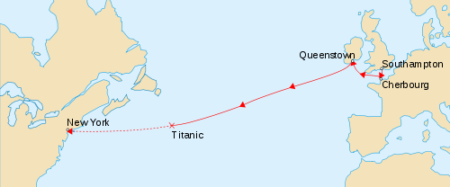

```{r setup, include=FALSE}
knitr::opts_chunk$set(echo = FALSE)
```
```{r , echo=FALSE , include=FALSE}
getwd()
library(modeest)
list.files()
train <- read.csv("train.csv", stringsAsFactors = FALSE)
head(train)
str(train)
```
## Titanic

El RMS Titanic fue un transatlántico británico, el mayor barco de pasajeros del mundo en el momento de su terminación, que se hundió en la noche del 14 al 15 de abril de 1912 durante su viaje inaugural desde Southampton a Nueva York. En el hundimiento del Titanic murieron 1514 personas de las 2223 que iban a bordo, lo que convierte a esta tragedia en uno de los mayores naufragios de la historia ocurridos en tiempo de paz. Construido entre 1909 y 1912 en el astillero Harland and Wolff de Belfast, el Titanic era el segundo de los tres transatlánticos que formaban la clase Olympic, propiedad de la naviera White Star Line, junto al RMS Olympic y, posteriormente, el HMHS Britannic.

Solo se analizarán 891 personas de las que se tienen registro.

## Describir el domino de la información
* Id 

* Sobrevivió : 1=Si, 0=no

* Nombre 

* Sexo : female= mujer,  male=hombre 

* Años 

##Describir el domino de la información
 
* Clase de pasajeros  : 1=Superior, 2=Mediana or 3=Baja

* Cabina 

<center>

</center> 
<sub><sup>Exposición Titanic Centenary 2012: La mayoría de los pasajeros de tercera clase, casi todos inmigrantes irlandeses, embarcaron en el Titanic con el objeto de cumplir el sueño de su vida: labrarse un porvenir en America y regresar a Irland</sup></sub>


##Domino de la información. [2]
* Número de hermanos / cónyuges en el extranjero 

* Número de padres / niños a bordo 

* Tarifa de pasajeros

* Puerto o embarcación: C = Cherbourg, Q = Queenstown,  S = Southampton 

##Domino de la información. [3]
* Número de Ticket
<center>

</center>

## Describir cada una de las variables.

Cantidad de pasajeros.
```{r, echo=FALSE}
length(train$Name)
```


Cantidad de pasajeros por clase

* En el siglo XIX la prioridad era el transporte

* El Titanic era el mayor y más lujoso barco jamás construido.

(1=Superior, 2=Mediana or 3=Baja)
```{r}
table(train$Pclass)
```


## Describir cada una de las variables. [2]
Cantidad de sobrevivientes  (0= murió, 1= vivió)
```{r}
train$Survived <- as.factor(train$Survived)
table(train$Survived)
```


Cantidad de hombre y mujeres
```{r}
train$Sex <- as.factor(train$Sex)
table(train$Sex)

```

Cantidad de sobrevivientes por sexo
```{r}
table(train$Sex, train$Survived)
```


##Describir cada una de las variables. [3]

Número de hermanos / cónyuges en el extranjero
```{r}
train$SibSp <- as.factor(train$SibSp)
table(train$SibSp)
```

Número de Padres / Niños a bordo
```{r}
train$Parch <- as.factor(train$Parch)
table(train$Parch)
```

Cantidad de tickets únicos. 
```{r}
length(unique(train$Ticket))
```

##Describir cada una de las variables. [4]


```{r}
train$Embarked <- as.factor(train$Embarked)
table(train$Embarked)
```

## Estadisticas básicas de resumen.
Ticket 
Entre los 891 boletos de embarque, había pasajeros compartiendo el mismo boleto, con los nombres de los **39** pasajeros mostrados abajo.

```{r}
shareTix <- train[train$Ticket %in% names(table(train$Ticket))[table(train$Ticket) > 5],]
shareTix[order(shareTix$Ticket),]$Name
```

## Boxplots. Interpretation.
Edades de pasajeros (Años)
```{r}
boxplot(train$Age, xlab="Edades de pasajeros (Años)")
```

## Histogramas.
Histograma de la edad.
```{r, echo=FALSE}
hist(na.omit(train$Age),
     main = "Histograma de las edades de los pasajeros",
     xlab = "Edad",
     ylab = "Personas",
     labels = TRUE)

```

## Cuartiles.
Cuartiles y rango intercuartil de la edad.
```{r, echo=FALSE}
summary(na.omit(train$Age))
IQR(na.omit(train$Age))
mlv(na.omit(train$Age), method = "mfv")[1]
```

## Cuartiles. [2]
Cuartiles y rango intercuartil de la tarifa.
```{r, echo=FALSE}
summary(na.omit(train$Fare))
IQR(na.omit(train$Fare))
mlv(na.omit(train$Fare), method = "mfv")[1]
```


## Correlación
Correlación: Correspondencia o relación
recíproca entre dos o más acciones o fenómenos.

Fórmula:
$r=\frac{n(\Sigma xy) - (\Sigma x)(\Sigma y)}{\sqrt{[n\Sigma x^{2} - (\Sigma x^{2})][[n\Sigma y^{2} - (\Sigma y^{2}]}}$

$\frac{\tilde{S}}{\sqrt{n}}$
Correlación entre la edad y la tarifa.
Se omitieron los valores nulos en esta operación.
```{r, echo=FALSE}
corAge <- na.omit(train$Age)
corFare <- na.omit(ifelse(is.na(train$Age),NA,train$Fare))
cor(corAge,corFare, use="complete.obs")

```

## Gráficos de dispersión.
La Gráfica de dispersión de la edad con respecto a la Tarifa.
```{r, echo=FALSE}
Fare = train$Fare
Age = train$Age
plot(Fare ~ Age, data=train, xlab = "Edad", ylab = "Tarifa")
abline(lm(Fare ~ Age, data=train))
```

## Clase con respecto a los sobrevivientes.
```{r, echo=FALSE}
pclassFac <- as.factor(train$Pclass)
surviFac <- factor(train$Survived, levels=c(0,1), labels=c('MURIO', 'SOBREVIVIO'))
plot(pclassFac,surviFac, xlab = "Clase", ylab ="Supervivencia")
```

## Sexo con respecto a los sobrevivientes.
```{r, echo=FALSE}
sexFac <- factor(train$Sex, labels=c('MUJER', 'HOMBRE'))
surviFac <- factor(train$Survived, levels=c(0,1), labels=c('MURIO', 'SOBREVIVIO'))
plot(sexFac,surviFac, xlab = "Sexo", ylab ="Supervivencia")
```

## Sobrevivientes con respecto a la embarcación  que subieron abordo del barco.

C = Cherbourg, Q = Queenstown,  S = Southampton
```{r, echo=FALSE}

embFac <- factor(train$Embarked)
surviFac <- factor(train$Survived, levels=c(0,1), labels=c('MURIO', 'SOBREVIVIO'))
plot(embFac,surviFac, xlab = "Embarcación", ylab ="Supervivencia")
```