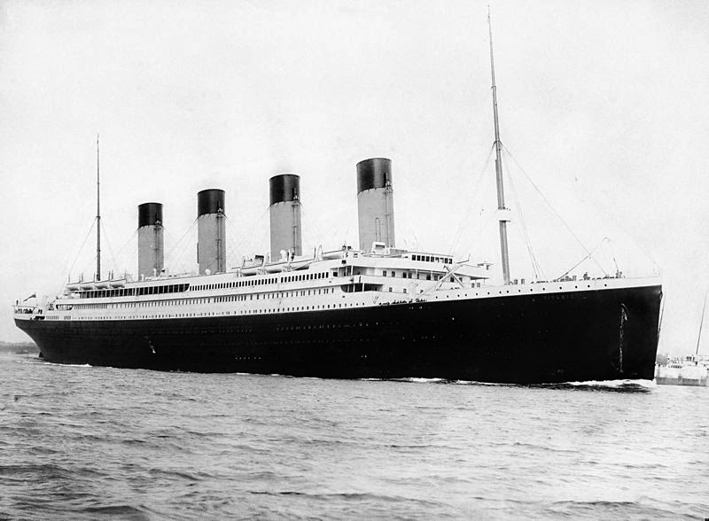
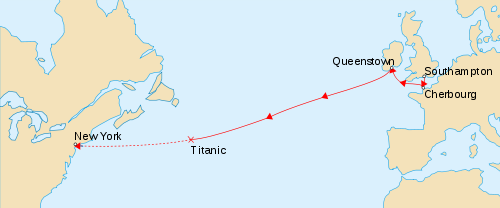

<center>

</center>


```{r setup, include=FALSE}
knitr::opts_chunk$set(echo = TRUE)
```

```{r , echo=FALSE , include=FALSE}
getwd()
list.files()
train <- read.csv("train.csv", stringsAsFactors = FALSE)
head(train)
str(train)
```

## Contexto 
El RMS Titanic fue un transatlántico británico, el mayor barco de pasajeros del mundo en el momento de su terminación, que se hundió en la noche del 14 a la madrugada del 15 de abril de 1912 durante su viaje inaugural desde Southampton a Nueva York. En el hundimiento del Titanic murieron 1514 personas de las 2223 que iban a bordo, lo que convierte a esta tragedia en uno de los mayores naufragios de la historia ocurridos en tiempo de paz. Construido entre 1909 y 1912 en el astillero Harland and Wolff de Belfast, el Titanic era el segundo de los tres transatlánticos que formaban la clase Olympic, propiedad de la naviera White Star Line, junto al RMS Olympic y, posteriormente, el HMHS Britannic.

<center>
<iframe width="560" height="315" src="https://www.youtube.com/embed/-96QC0C7xW4" frameborder="0" allowfullscreen></iframe>
</center>
## Describir el domino de la información
Id 

Sobrevivió : 1=Si, 0=no

Clase de pasajeros  : 1=Superior, 2=Mediana or 3=Baja

Nombre 

Sexo : female= mujer,  male=hombre 

Años 

Número de hermanos / cónyuges en el extranjero 

Número de padres / niños a bordo 

Número de Ticket  

Tarifa de pasajeros

Cabina 

Puerto o embarcación: C = Cherbourg, Q = Queenstown,  S = Southampton 


## Describir cada una de las variables.
Cantidad de sobrevivientes  (0= murió, 1= vivió)
```{r}
train$Survived <- as.factor(train$Survived)
table(train$Survived)
```

Cantidad de pasajeros por clase
(1=Superior, 2=Mediana or 3=Baja)
```{r}
table(train$Pclass)
```

Cantaidad de pasajeros, no se tiene un registro de los trabajadores.
```{r}
length(train$Name)
```


Sex 
```{r}
train$Sex <- as.factor(train$Sex)
table(train$Sex)
table(train$Sex, train$Survived)
```

SibSp  "Número de hermanos / cónyuges en el extranjero"
```{r}
train$SibSp <- as.factor(train$SibSp)
table(train$SibSp)
```

Parch  "Parche Número de Padres / Niños a bordo"
```{r}
train$Parch <- as.factor(train$Parch)
table(train$Parch)
```


Cantidad de tickets únicos. 
```{r}
length(unique(train$Ticket))
```



```{r}
train$Embarked <- as.factor(train$Embarked)
table(train$Embarked)
```


## Estadisticas básicas de resumen.
Sobrevivientes 
```{r}
summary(train$Survived)
```

Clase (1=Superior, 2=Medio or 3=Baja)
```{r}
summary(train$Pclass)
```

Total de personas a bordo del Titanic 
```{r, echo=FALSE}
summary(train$Name)
```


Sexo de los pasajeros (female=mujer, male=hombre)
```{r}
summary(train$Sex)
```

Número de hermanos / cónyuges en el extranjero
```{r}
summary(train$SibSp)
```

Parche Número de Padres / Niños a bordo
```{r}
summary(train$Parch)
```


Ticket 
Entre los 891 boletos de embarque, había pasajeros compartiendo el mismo boleto, con los nombres de los 39 pasajeros mostrados abajo.
```{r}
shareTix <- train[train$Ticket %in% names(table(train$Ticket))[table(train$Ticket) > 5],]
shareTix[order(shareTix$Ticket),]$Name
```

## Boxplots. Interpretation.
Edades de pasajeros (Años)
```{r}
boxplot(train$Age, xlab="Edades de pasajeros (Años)")
```


## Inclinación de los datos. Interpretación.

```{r, echo=FALSE}
summary(na.omit(train$Age))
median(na.omit(train$Age))

```

```{r, echo=FALSE}
hist(na.omit(train$Age),
     main = "Histograma de las edades de los pasajeros",
     xlab = "Edad",
     ylab = "Personas",
     labels = TRUE)


```


## Histogramas.
Histograma de la edad.

Al revisar este histograma, lo que nos indica es que mas del 60% de las personas tenían menos de 40 años, así como, la mayor cantidad de personas tenían entre 20 a 30 años de edad respecto a las otras columnas.
```{r, echo=FALSE}
hist(na.omit(train$Age),
     main = "Histograma de las edades de los pasajeros",
     xlab = "Edad",
     ylab = "Personas",
     labels = TRUE)

```

## Cuartiles.
Cuartiles y rango intercuartil de la edad.

Se puede denotar aquí que el 50 % de las personas está entre los 20 años y los 38, es donde esta la mayor concentración de las personas que iban en el Titanic.Además, la persona con menos edad era un bebé de aproximadamente 5 meses, y la persona con más edad era una persona de 80 años
```{r, echo=FALSE}
summary(na.omit(train$Age))
IQR(na.omit(train$Age))
```
Cuartiles y rango intercuartil de la tarifa.

Se puede denotar aquí que el 50 % de las personas pagaron una tarifa entre 7.91 y 31.00 en la moneda que se haya pagado. Además, existieron personas que no pagaron ni un solo centavo, se subieron gratis, y otra persona que pagó 512.30 que fue la que dió más.
```{r, echo=FALSE}
summary(na.omit(train$Fare))
IQR(na.omit(train$Fare))
```

## Correlación
Correlación: Correspondencia o relación recíproca entre dos o más acciones o fenómenos.

Correlación entre la edad y la tarifa.

Al observar esta correlación entre estos dos datos, se puede observar que tienen una ligera correlación, por lo que al aumentar una, ligera, muy ligeramente aumentará la otra.
Se omitieron los nulos en esta operación.
```{r, echo=FALSE}
corAge <- na.omit(train$Age)
corFare <- na.omit(ifelse(is.na(train$Age),NA,train$Fare))
cor(corAge,corFare, use="complete.obs")

```

## Gráficos de dispersión.
La Gráfica de dispersión de la edad con respecto a la Tarifa.

Como se puede apreciar en la correlación que tienen estás dos variables, tienen una relación positiva muy baja, por lo que nos indica que si la edad aumenta, la tarifa aumenta relativamente poco.
```{r, echo=FALSE}
Fare = train$Fare
Age = train$Age
plot(Fare ~ Age, data=train, xlab = "Edad", ylab = "Tarifa")
abline(lm(Fare ~ Age, data=train))
```


## Gráficos Aparte.
Representación de la clase con respecto a los sobrevivientes/muertos de cada una.

En la gráfica se puede observar que la mayor cantidad de personas que se salvaron fueron los de la clase 1, que casi se salvaron alrededor de 3/5, por lo que si eras de la clase 1 tenías muchas más probabilidades de salvarte.

Por el lado contrario, los que más se murieron fueron los de la clase 3, muriendo casi el 80 %, lo que quiere decir que si eras de clase 3 tenías pocas probabilidades de sobrevivir.

La clase 2 en su defecto fue la más balaceada, casi sobrevivieron la misma cantidad que murieron.
```{r, echo=FALSE}
pclassFac <- as.factor(train$Pclass)
surviFac <- factor(train$Survived, levels=c(0,1), labels=c('MURIO', 'SOBREVIVIO'))
plot(pclassFac,surviFac, xlab = "Clase", ylab ="Supervivencia")
```

Representación de el sexo con respecto a los sobrevivientes.

Lo que se puede observar en la gráfica, es que la mayoría de los hombres se sacrificaron para salvar a casi el 80 % de las mujeres, gracias a tener una postura machista, esto sucedió.
```{r, echo=FALSE}
sexFac <- factor(train$Sex, labels=c('MUJER', 'HOMBRE'))
surviFac <- factor(train$Survived, levels=c(0,1), labels=c('MURIO', 'SOBREVIVIO'))
plot(sexFac,surviFac, xlab = "Sexo", ylab ="Supervivencia")
```

Representación de los sobrevivientes con respecto a la embarcación  que subieron abordo del barco.

Al observar la gráfica la mayor parte de los que se subieron en la embarcación de Cherbourg sobrevivieron, por que se tenía más probabilidad de sobrevivir, aunque la mayoría de las personas se subieron en la embarcación de Southampton, fueron menos personas las que sobrevivieron con respecto al porcentaje original de las personas que se subieron en esa embarcación, por lo que si te subiste en esta embarcación, quizás tenías menos probabilidad de sobrevivir.
```{r, echo=FALSE}

embFac <- factor(train$Embarked)
surviFac <- factor(train$Survived, levels=c(0,1), labels=c('MURIO', 'SOBREVIVIO'))
plot(embFac,surviFac, xlab = "Embarcación", ylab ="Supervivencia")
```